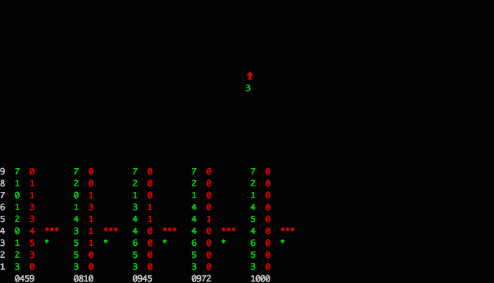

## What is this?

A ridiculous terminal game to test your ability to judge time.

## Install

`go get github.com/erinok/howlonghowlong`

## Play

Run `howlonghowlong` in a terminal.

Press space to flash the screen.

How long did the screen flash?

100ms? Type `1`. 200? Type `2`. And so on, up to 900 milliseconds.

After guessing, you'll be shown if your guess was correct. Press space for the next flash.

Your score so far is tallied in columns along the bottom of the screen. The leftmost column is for perfect guesses, the next column for guesses correct +/- 100ms, the next for +/- 200ms, and so on.

## Stop Playing

Type "q".
